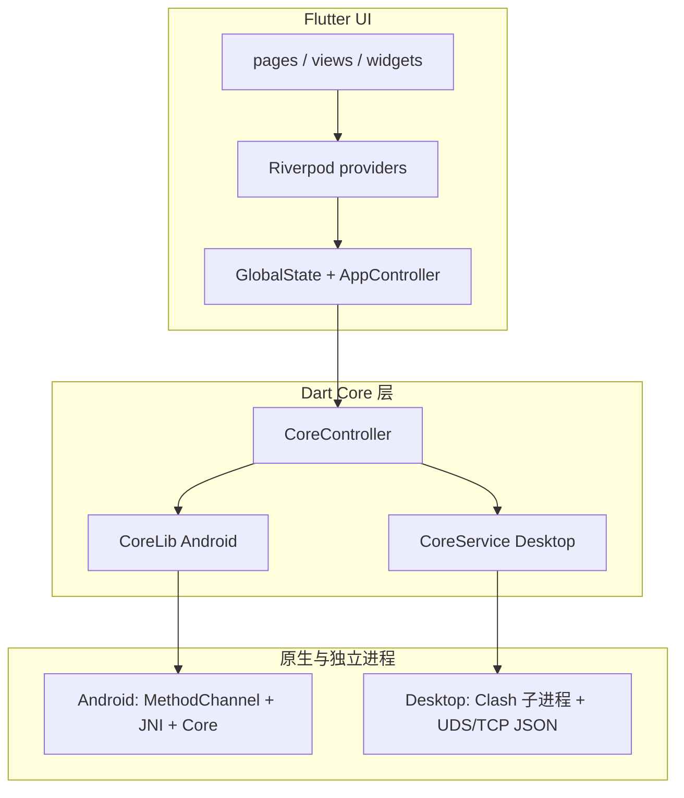

# FlClash 技术架构

本文档描述 FlClash 仓库内的技术分层、核心模块职责，以及与 Clash.Meta 的集成方式。内容以当前代码与 `pubspec.yaml` 为准。

## 1. 项目定位

FlClash 是基于 **Clash.Meta** 的多平台代理客户端：用户界面与业务逻辑由 **Flutter / Dart** 实现；**Clash 核心**以 **Go（Clash.Meta，位于 `core/Clash.Meta` 子模块）** 构建，通过 **平台相关的原生桥接** 与 Dart 层通信。构建环境需 **Flutter** 与 **Golang**，并初始化子模块（见根目录 `README.md`）。

支持平台：**Android、Windows、macOS、Linux**。

## 2. 技术栈概览

| 类别          | 技术                                                             |
| ------------- | ---------------------------------------------------------------- |
| UI 框架       | Flutter（SDK `>=3.8.0 <4.0.0`）                                  |
| 状态管理      | Riverpod（`flutter_riverpod`、`riverpod_annotation` + 代码生成） |
| 数据模型      | Freezed、`json_serializable`                                     |
| 网络          | Dio、WebDAV（`webdav_client`）                                   |
| 持久化 / 路径 | `shared_preferences`、`path_provider`                            |
| 桌面集成      | `window_manager`、`tray_manager`、`hotkey_manager` 等            |
| 国际化        | `flutter_localizations`，ARB → `lib/l10n`                        |
| 脚本运行时    | `flutter_js`（Git 依赖）                                         |

## 3. 分层架构

### 3.1 表现层

- **`lib/pages/`**：页面入口与路由相关页面（如首页、编辑器、扫码）。
- **`lib/views/`**：功能视图（仪表盘、代理、配置、连接、日志、关于等）。
- **`lib/widgets/`**：可复用 UI 组件。

设计取向：Material 体系，配合 **Material You / 动态配色**（`dynamic_color`），多端自适应布局。

### 3.2 应用状态与业务编排

- **Riverpod**：`lib/providers/` 及 `lib/providers/generated/`，管理配置、运行状态、日志列表等。
- **`GlobalState`（`lib/state.dart`）**：全局单例，承载定时任务、导航键、主题与测量缓存、`AppController` 引用等。
- **`AppController`（`lib/controller.dart`）**：面向 UI 的业务编排（启动/停止、订阅更新、配置补丁等）。
- **`lib/manager/`**：按能力拆分——窗口、托盘、热键、系统代理（桌面）、Android VPN/磁贴等；在 `lib/application.dart` 中按平台用 Widget 嵌套组合。

### 3.3 核心抽象层（Clash Core）

Dart 侧通过统一接口访问 Clash 核心，避免 UI 直接依赖平台细节。

- **`CoreInterface` / `CoreHandlerInterface`（`lib/core/interface.dart`）**：核心能力约定（初始化、配置校验与下发、代理列表与切换、流量、连接、日志、Geo 等）。
- **`CoreController`（`lib/core/controller.dart`）**：单例门面，按平台选择实现：
  - **Android**：`CoreLib`（`lib/core/lib.dart`）→ **MethodChannel** → 原生服务（代码注释：**MethodChannel → JNI → ClashCore**）。
  - **macOS / Windows / Linux**：`CoreService`（`lib/core/service.dart`）→ **独立子进程** + **Socket**：
    - macOS / Linux：**Unix Domain Socket**
    - Windows：**TCP**
    - 报文为 **JSON**，按行解析；异步结果封装为 `ActionResult`，事件为 `CoreEvent`。
- **`CoreManager`（`lib/manager/core_manager.dart`）**：挂在 Widget 树上，监听 Riverpod 与核心事件（换配置、参数更新、日志开关、延迟测速、请求追踪、崩溃等），并回写 Provider。

### 3.4 数据与模型

- **`lib/models/`**：领域与配置模型，配合 Freezed / `json_serializable`（生成文件在 `models/generated/`）。
- **资源与本地文件**：地理库等通过 **assets** 首次解压到应用目录（见 `CoreController.initGeo`）。
- **订阅与同步**：HTTP 拉取订阅；可选 **WebDAV** 同步数据。

## 4. 逻辑关系示意

## 5. 本地插件与平台代码

| 路径                          | 作用                                                                        |
| ----------------------------- | --------------------------------------------------------------------------- |
| `plugins/proxy`               | 系统代理等桌面侧能力（含 Windows 等平台原生实现）                           |
| `plugins/window_ext`          | 窗口相关扩展                                                                |
| `lib/plugins/service.dart`    | Android：`MethodChannel` 与后台服务交互（`invokeAction`、事件、`crash` 等） |
| `plugins/flutter_distributor` | 打包分发工具链，非应用运行时核心                                            |

## 6. 应用入口说明

- **`lib/main.dart`**：`WidgetsFlutterBinding` → 全局初始化 → `ProviderScope` 包裹 `Application`；另有无界面服务入口（如磁贴启动）调用 `coreController` 与 `globalState`。
- **`lib/application.dart`**：`MaterialApp`、本地化、`CoreManager` 与平台 Manager 嵌套、定时任务（如配置自动更新）等。

## 7. 小结

FlClash 采用 **Flutter 多端 UI + Riverpod / 全局控制器组织业务 + `CoreController` 统一封装 Clash 核心**。Android 走 **MethodChannel / JNI**；桌面端 **拉起 Clash.Meta 子进程**，通过 **Unix Socket 或 TCP** 以 **JSON** 协议通信，并由各 **Manager** 与 **插件** 完成系统代理、窗口、托盘、热键、VPN 等平台集成。

---

_文档随仓库演进可能过时；重大结构调整时请同步更新本文。_
